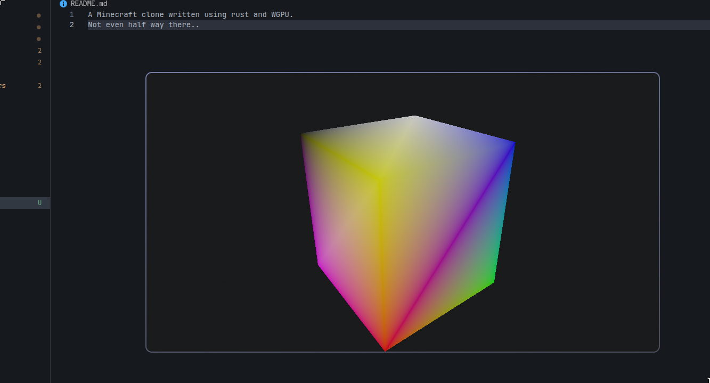

# Voxels

A Minecraft-inspired voxel game written from scratch using **Rust** and **WGPU**.

> Work in progress. Not even half way there yet.



## Why?

I wanted to understand how games like Minecraft work under the hood, so I decided to build a voxel engine from scratch instead of using a game engine.

The main goal is to learn about 3D rendering, GPU programming, chunk systems, mesh generation, world generation, and optimization.

## Tech Stack

* **Rust** for the engine
* **WGPU** for rendering
* **WGSL** for shaders
* **Cargo** for building and managing dependencies

## Progress

Currently implemented:

* WGPU renderer
* 3D camera
* Basic voxel rendering
* Basic world representation

Planned:

* Chunk system and meshing
* Textures and texture atlas
* Player movement and collision
* Procedural terrain
* Lighting
* Block placement and breaking
* World saving/loading

## Running

```bash
git clone https://github.com/FaizeenHoque/Voxels
cd Voxels
cargo run
```

You can also check the Releases page for pre-built versions if available.

## Status

This is mainly a learning project, so the architecture will probably change a lot as development continues.

The end goal is a small, functional Minecraft-like game built entirely in Rust.
